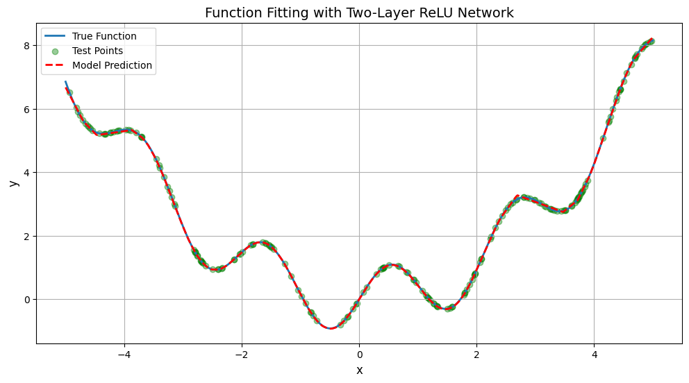

# 函数拟合报告

## 1、函数定义
在本项目中，我尝试使用pytorch实现一个简单的神经网络来拟合一个数学函数，其定义如下：
$$
f(x) = \sin(3x) + 0.3x^{2}
$$


## 2、数据采集
为了训练和测试神经网络，首先需要生成对应的数据集。包括：

训练集：包含1000个样本，每个样本的x值在$[-5, 5]$范围内均匀分布。
测试集：包含200个样本，x值在相同的范围内均匀分布。测试集用于在训练完成后评估模型的拟合效果。

```
def generate_data():
    # 训练数据 (1000个样本)
    x_train = np.random.uniform(-5, 5, size=(1000, 1)).astype(np.float32)
    y_train = target_function(x_train).astype(np.float32)
    
    # 测试数据 (200个样本)
    x_test = np.random.uniform(-5, 5, size=(200, 1)).astype(np.float32)
    y_test = target_function(x_test).astype(np.float32)
    
    # 转换为PyTorch张量
    x_train_tensor = torch.from_numpy(x_train)
    y_train_tensor = torch.from_numpy(y_train)
    x_test_tensor = torch.from_numpy(x_test)
    y_test_tensor = torch.from_numpy(y_test)
    
    return (x_train_tensor, y_train_tensor), (x_test_tensor, y_test_tensor)
```

## 3、模型描述
构建了包含2个隐藏层的神经网络模型，使用ReLU作为激活函数。模型的结构如下：

```
self.model = nn.Sequential(
    nn.Linear(1, hidden_size),  # 输入层 -> 隐藏层
    nn.ReLU(),                   # ReLU激活
    nn.Linear(hidden_size, int(hidden_size/2)),    # 隐藏层 -> 隐藏层
    nn.ReLU(),                 # ReLU激活
    nn.Linear(int(hidden_size/2), 1)  # 隐藏层 -> 输出层
)
```

## 4、拟合效果
拟合效果如下：
